# Greenhouse Ivy - Automations & Utils

## Ansible

### Configuration

To configure the project, we have created the folder `/greenhouse` that will contain this repository with all devops configs.

See below the three of folders:

```
/greenhouse/
└── ivy-automation
    ├── ansible
    │   ├── ansible.cfg
    │   ├── ansible_vault_password
    │   ├── inventory
    │   │   ├── computers
    │   │   └── host_vars
    │   │       ├── debian.yml
    │   │       ├── rpi.yml
    │   │       ├── vault.yml (only on the machine. Ignored on repo.)
    │   │       └── w3070.yml
    │   ├── playbooks
    │   │   ├── ping.yml
    │   │   └── variable_checker.yml
    │   └── ssh
    │       ├── id_ansible
    │       └── id_ansible.pub
    ├── LICENSE
    ├── profiles
    │   └── ...
    └── README.md

```

#### Inventory

File that will contain the list of IP, hostnames or DNS names that Ansible will manage. On [ansible.cfg](./ansible/ansible.cfg) file, we have added the variable `inventory` that contains the path for the main inventory that we will use.

```yml
all:
    children:
        windows:
            hosts:
                w3070:
        linux:
            hosts:
                rpi:
                debian:
        vbox:
            hosts:
                debian:
        greenhouse:
            hosts:
                w3070:
                rpi:
                debian:
```

#### Connectivity Check

Let first add the next command to ensure that ansible is able to reach all given machines in `/ansible/config/inventory` file.

```bash
$ ansible all --key-file /path/to/ssh/key -i /path/to/inventory/file -m ping --limit {host-name}
# ex
$ ansible all -i inventory.yaml -m win_ping --limit w3070
$ ansible all -i inventory.yaml -m ping --limit rpi
```

#### WinRm - Setting Up a Windows Host

Using as reference [Official Ansible Docs for Windows Setup][Official Ansible Docs - Windows Setup]

##### Upgrade of Powershell

```powershell
# Check versions available
> winget search Microsoft.PowerShell
# Install
> winget install --id Microsoft.Powershell --source winget
> winget install --id Microsoft.Powershell.Preview --source winget
```

### SSH Key Generation

To check the current Keys check folder `\home\{user}\.ssh`. Inside should be located the file `known_hosts` plus the keys generated.

```bash
# To generate a key, execute the next command:
$ ssh-keygen -t ed25519 -C Ansible
# To copy the ssh key to a Server
$ ssh-copy-id -i {oath of public ssh key. ie: /home/gh/.ssh/id.pub} {IP of the Server}
```

### Vaults

To make the setup, we created the file `inventory/host_vars/vault.yml` and added all credentials to make reference to them later on playbooks.

Once created, just do `ansible-vault encrypt`.

```bash
$ ansible-vault encrypt --vault-password-file ansible_vault_password inventory/host_vars/vault.yml
$ ansible-vault view --vault-password-file ansible_vault_password inventory/host_vars/vault.yml  
$ ansible-vault edit --vault-password-file ansible_vault_password inventory/host_vars/vault.yml
```

On [ansible.cfg](./ansible/ansible.cfg) file, we have added the variable `vault_password_file` that contains the password used to encrypt in vault. So it won't require to use the flag `--vault-password-file ansible_vault_password` anymore.

### References

[Official Docs - Debian installation]: https://docs.ansible.com/ansible/latest/installation_guide/installation_distros.html#installing-ansible-on-debian 	"Debian Installation"
[Youtube - Learn Linux TV - Getting Started with Ansible]: https://www.youtube.com/playlist?list=PLT98CRl2KxKEUHie1m24-wkyHpEsa4Y70 "Learn Linux TV - Getting Started with Ansible"
[Reference - Jeff Geerling]: https://www.jeffgeerling.com/blog	"Jeff Geerling"
[Reference - Percy Grunwald]: https://www.percygrunwald.com/ "Percy Grunwald"
[Official Ansible Docs - Windows Setup]: https://docs.ansible.com/ansible/latest//os_guide/windows_setup.html#windows-setup "Windows Setup"

## Profiles
The `.bashrc` file includes few tiny functions that would help and make environments more comfortable.

### Required Environment Variables

| Variable  Name              | Description                                                  | Example                           |
| --------------------------- | ------------------------------------------------------------ | --------------------------------- |
| `BASE_GREENHOUSE_WORKSPACE` | Main folder where the repositories of Greenhouse are placed. | /c/Users/mike/Documents/Workspace |

## Quick summary of System CTL commands:

Explanation of Commands:

- `systemctl start <service>`: Starts the service immediately (in this case, SSH).
- `systemctl enable <service>`: Enables the service to start automatically at system boot.
- `systemctl status <service>`: Shows the current status of the service (running, stopped, etc.).
- `systemctl is-enabled <service>`: Checks if the service is enabled to start on boot.
- `systemctl stop <service>`: Stops the service immediately.
- `systemctl disable <service>`: Disables the service from starting at boot.

## Proxmox

### LXC in Raspberry Pi


### [Optional] Proxmox through Wifi - Desactualizado....

At the time this README file is being written, the Server where I install Proxmox does not have the capability to be connected directly to the internet using cable. So I have to do a little bit of research....

[I ended up on this post](https://forum.proxmox.com/threads/howto-proxmox-ve-8-x-x-wifi-with-routed-configuration.147714/). So, let's go:

The first steps require cable, just to update the packages and install **wpasupplicant**.

```shell
> apt update && apt install wpasupplicant
> systemctl disable wpa_supplicant
# OBVIOUSLY, replace SSIDNAME and PASSWORD by yours
> wpa_passphrase SSIDNAME PASSWORD >> /etc/wpa_supplicant/wpa_supplicant.conf
```

I have the same verification message than the offer on the Tutorial:

```shell
> dmesg | grep wlp
[    4.021984] rtw89_8852be 0000:04:00.0 wlp4s0: renamed from wlan0
```

Create `/etc/systemd/system/wpa_supplicant.service` and add configuration. As show above, it's **wlp4s0**.

```shell
touch /etc/systemd/system/wpa_supplicant.service
```

Code:

```shell
[Unit]
Description=WPA supplicant
Before=network.target
After=dbus.service
Wants=network.target
IgnoreOnIsolate=true
 
[Service]
Type=dbus
BusName=fi.w1.wpa_supplicant1
ExecStart=/sbin/wpa_supplicant -u -s -c /etc/wpa_supplicant/wpa_supplicant.conf -i wlp4s0
Restart=always
 
[Install]
WantedBy=multi-user.target
Alias=dbus-fi.w1.wpa_supplicant1.service
```

Now, enable again **wpasupplicant**.

```shell
> systemctl enable wpa_supplicant
```

Modify again `/etc/network/interfaces` file:

```shell
auto lo
iface lo inet loopback

iface enp3s0 inet manual

# This block are the lines that I edit
auto wlp4s0
iface wlp4s0 inet static
    address 192.168.3.10/22
    gateway 192.168.0.1
#

auto vmbr0
iface vmbr0 inet static
        address 192.168.1.11/22
        bridge-ports enp3s0
        bridge-stp off
        bridge-fd 0

source /etc/network/interfaces.d/*
```

Restart **wpasupplicant** and **networking services** to connect wireless adapter to wifi network

```shell
> systemctl restart wpa_supplicant && systemctl restart networking
```

Finally, as the tutorial said, I made the last update on `/etc/network/interface`:

```shell
auto lo
iface lo inet loopback

iface enp3s0 inet manual

auto wlp4s0
iface wlp4s0 inet static
        address 192.168.3.11/22
        gateway 192.168.0.1

auto vmbr0
iface vmbr0 inet static
        address 192.168.3.10/22
        bridge-ports none
        bridge-stp off
        bridge-fd 0

auto home
iface home inet static
        address 192.168.3.12/22
        bridge-ports none
        bridge-stp off
        bridge-fd 0
        hwaddress 0b:a0:e2:b6:b6:08
        post-up echo 1 > /proc/sys/net/ipv4/ip_forward
        post-up iptables -A FORWARD -i wlp4s0 -j ACCEPT
        post-up iptables -A FORWARD -o wlp4s0 -j ACCEPT
        post-up iptables -A FORWARD -i home -j ACCEPT
        post-up iptables -A FORWARD -o home -j ACCEPT

source /etc/network/interfaces.d/*
```

## Docker

### (old) VPN Diagram


### Zero Trust Diagram


### Docker Compose

The  [main file](docker/docker-compose.yml)  has been split to avoid to have one big file wiht eveything. This will make the maintenance and review changes more confortable.

| Filename                                                     | Description & Content                                        |
| :----------------------------------------------------------- | ------------------------------------------------------------ |
| [docker-compose.yml](docker/docker-compose.yml)              | Network, Volumes and Include the rest of the docker-compose files. |
| [docker-compose.critical.yml](docker/docker-compose.critical.yml) | [CA Server][ca] & [AdGuardHome][adguard]                     |
| [docker-compose.proxy.yml](docker/docker-compose.proxy.yml)  | [Traefik][traefik]                                           |
| [docker-compose.frontend.yml](docker/docker-compose.frontend.yml) | Greenhouse Main Page.                                        |
| [docker-compose.apps.yml](docker/docker-compose.apps.yml)    | [NoIP][noip], [TeamSpeak][teamspeak] & Traefik Dummy Whoami  |
| [docker-compose.vpn.yml](docker/docker-compose.vpn.yml)      | [Wireguard EZ][ez_wg]                                        |
| [docker-compose.zero.trust.yml](docker/docker-compose.zero.trust.yml) | [Twingate Connector][tw_con]                                 |
| [docker-compose.monitoring.yml](docker/docker-compose.monitoring.yml) | [RPi Monitor][rpi_mon]                                       |
| [docker-compose.cloud.yml](docker/docker-compose.cloud.yml)  | [Jellyfin][jellyfin] and [Nexcloud][nextcloud] with his own [Redis][redis] & [Postgres][postgres]. |

### Environment File

To wake up this project you will require to setup several environment files:

- Main environment file
- Each service that require his environment file (example [NoIP-duc][noip] for credentials)

You can follow the templates defined on [.template.env](docker\env\.template.env). The service that requires the file, should have a .template file as well.

### Port Forwarding for VPN configuration

> First of all, log in on your router, and apply the port forwarding for the machine that you will use as a host pf this project.
>
> Each router has their own way of configuring this, so time to use Google.

|           Application           | Default Ports | Description      |
| :-----------------------------: | :-----------: | ---------------- |
|       [Wireguard][ez_wg]        |     51820     | VPN connectivity |
|       [Adguard][adguard]        |      53       | DNS              |
| [Teamspeak (ertagh)][ts_ertagh] |     9987      | Voice            |
| [Teamspeak (ertagh)][ts_ertagh] |     10011     | Server Query     |
| [Teamspeak (ertagh)][ts_ertagh] |     30033     | File transfer    |
|       [Traefik][traefik]        |      443      | For Proxy        |

### Firewall

The only port at the moment that is required to be included on the firewall is the connectivity for port for [Wireguard][wireguard], port **51820**.

#### Windows

Search and open **Windows Defender Firewall**. Go to **Advanced settings**


Go to **Inbound Rules** and **New Rule...** as we are allowing external connections.


Click on **Port** and add the list of ports provided above + click on **TCP**.


Let's go at the moment with Allow the connection option.


Once completed, you will see the new rule on the Inbound Rules window. In this sample, **Greenhouse Ports**.


#### Mac

Open the terminal and modify the next file

``````bash
> sudo nano /etc/pf.conf
``````

**For each** port that you want to open, add the next line:

``````bash
pass in proto tcp from any to any port [PORT]
``````

The next lines would be use to activate/deactivate the rule:

``````bash
> sudo pfctl -f /etc/pf.conf
# Activate
> sudo pfctl -e
# Deactivate
> sudo pfctl -d
``````

To test if it is working or not:

``````bash
> sudo lsof -i :[PORT]

# The expected response should something similar to this:

> sudo lsof -i :51820
COMMAND    PID      USER   FD   TYPE             DEVICE SIZE/OFF NODE NAME
com.docke 3836   usename  200u  IPv6 0x0000000000000001      0t0  UDP *:51820
> sudo lsof -i :51821
COMMAND    PID      USER   FD   TYPE             DEVICE SIZE/OFF NODE NAME
com.docke 3836   usename  199u  IPv6 0x0000000000000001      0t0  TCP *:51821 (LISTEN)
``````

### How to Forward traffic from [NoIp](https://www.noip.com/) to the computer

The way how the Internet provider maintain our IP can be different. They can update our IP when we restart the router or in any moment. 

There are lot of webages that can provide this info ([ipinfo.io](https://ipinfo.io/what-is-my-ip), [ipaddress.my](https://www.ipaddress.my/), [showmyip.com](https://www.showmyip.com/), [whatismyip.com](https://www.whatismyip.com/)...).

> Why NoIp? They offer by free one hostname which we will use to forward our traffic for, here it comes, **FREE**.

The screenshot of below shows how the NoIp hostname page looks like. Here you will see your hostname plus the IP where is aiming at the moment. When you are developing, you can, a, ping directly your public IP or b, use this domain.


### Certificate Authority Server

For this, we will be using [smallstep/step-ca][ca] image. 

[Follow their documentation page to make a initial setup of the server before continue](https://smallstep.com/docs/tutorials/docker-tls-certificate-authority/).

Greenhouse is aiming to have your own local domain only accessible once you are connected with the VPN. Because of that, you will not need buy any domain or trust any external CA for much open-source they are.

> Be aware if you are using a Raspberry Pi as I am, [to check this link](https://smallstep.com/docs/tutorials/docker-tls-certificate-authority/#raspberry-pi-badger-database-errors). In my case it happen 2 issues:
>
> First one was fixed applying the changes on the link regarding the DB:
>
> ```json
>  "db": {
>        "type": "badger",
>        "dataSource": "/home/step/db",
>        "badgerFileLoadingMode": "FileIO"
>  },
> ```
>
> And later, I had to update the permissions of my volume folders. But this is my issue as my users are not very well configured:
>
> >  docker run --rm -v prod-ca-db:/data alpine chown -R 1000:1000 /data
>
> For windows, run this command on Powershell to avoid 
>
> > docker run --rm -v dev-ca-db:/home/step/db alpine chown -R 1000:1000 /home/step/db


> All this trouble can be ignored if you configure their own postgres.
>
> Add the ACME and configure the ca.json with the DB.


If everything works as expected, execute the commands of below to include the new provisioner.

```bash
# Log to the container the 
> docker exec -it ca sh

# Add the new ACME provisioner. After this, ensure to restart to asure the config has been applied.
> step ca provisioner add greenhouse-acme --type ACME
```

With this, should be enough to make it work!

> DONT FORGET TO INCLUDE THE NEW CERTIFICATES IN YOUR DEVICES !

Additionally, I added few improvements on the **ca.json**. Not sure if neccesary but I will list them below:

```json
...
	"dnsNames": [
		"localhost",
		"ca.dev.greenhouse.ogt",
		"traefik.dev.greenhouse.ogt",
		"vpn.dev.greenhouse.ogt",
		"adguard.dev.greenhouse.ogt",
		...
		"dev.greenhouse.ogt"
	],
...
	"policy": {
		"x509": {
			"allow": {
				"dns": ["*.dev.greenhouse.ogt"]
			},
			"allowWildcardNames": false
		},
		"host": {
          "allow": {
				"dns": ["*.dev.greenhouse.ogt"]
          }
        }
	},
...
	"db": {
		"type": "postgresql",
		"dataSource": "",
		"badgerFileLoadingMode": ""
	},
...
    {
        "type": "ACME",
        "name": "greenhouse-acme",
        "claims": {
            ...
        },
        "challenges": [
            "tls-alpn-01"
        ],
        "attestationFormats": [
            "apple",
            "step",
            "tpm"
        ],
        "options": {
            "x509": {
                "enabled": true,
                "durations": {
                    "default": "168h",
                    "min": "5m",
                    "max": "12000h"
                }
            },
            "ssh": {}
        }
    }
...
	"commonName": "Step Online CA for ${REPLACE THIS WITH YOUR DOMAIN}"
```

#### Install the Certificate

The file we will need to import is **root_ca.crt**. It will be placed on **Step-ca Volume**, `/cert` folder.

#### Windows

Double click on the file `root_ca.crt` > Click on `Install Certificate` > Your User or All the machine (Up to you) > Browse to `Trusted Root Certification Authorities`. Done :heart:

After importing the certificate, restart the browsers and the "Insecure webpage" messages should disappear.

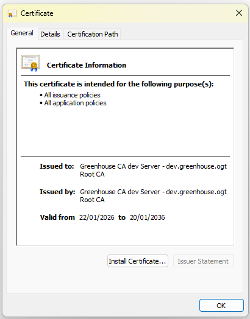

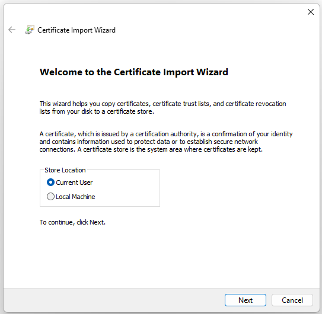

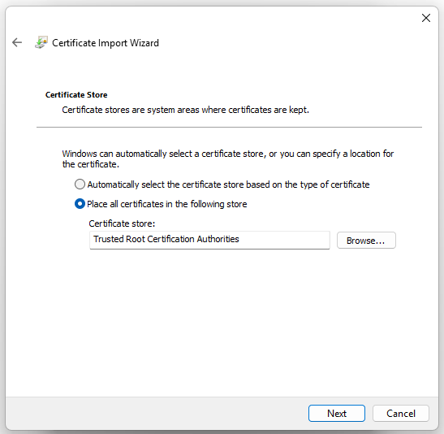

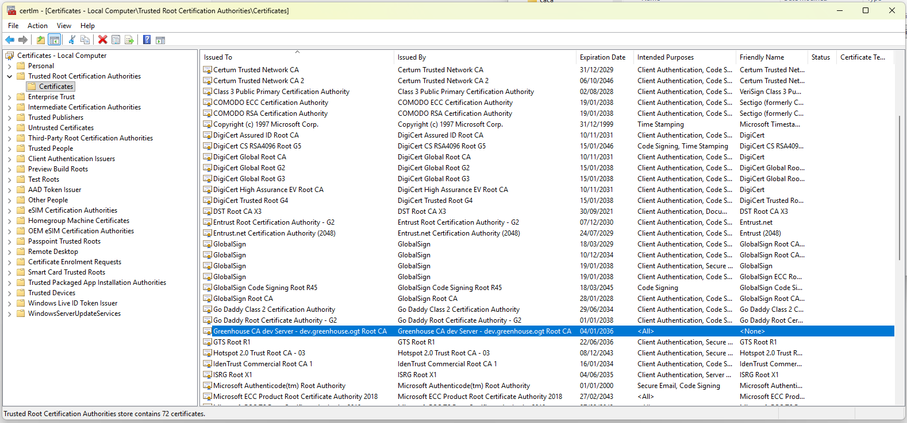

### Authentik

Will be used to configure the Authentication layer on the project. The plan is to configure each service exposed with it to ensure security.

#### First Step

The first step as the [documentation page say](https://docs.goauthentik.io/install-config/install/docker-compose/) is to go to https://your.authentik.domain/if/flow/initial-setup/ and setup your admin user. I will use it to configure mine and later disable the default admin user. Just in case.

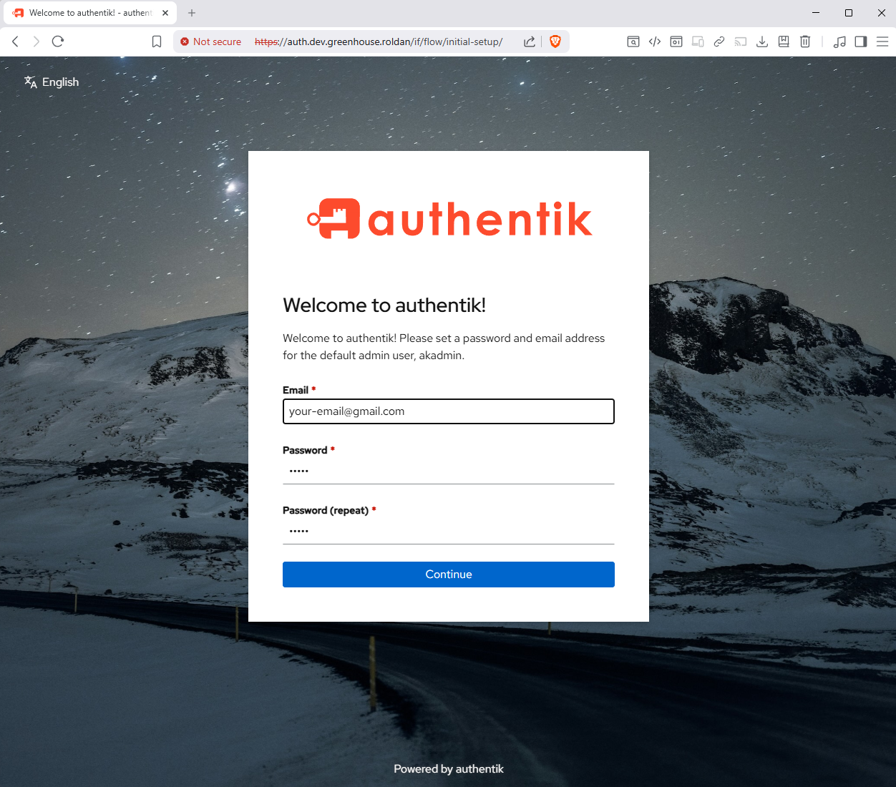

After log in, click  on `Admin Interface` > Directory > Users. And create a new user. Make sure to add it as *User Type* **Internal**. 

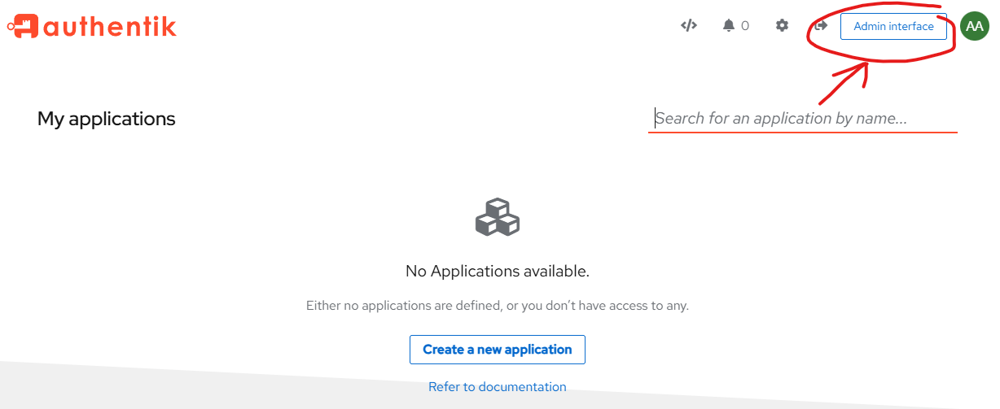

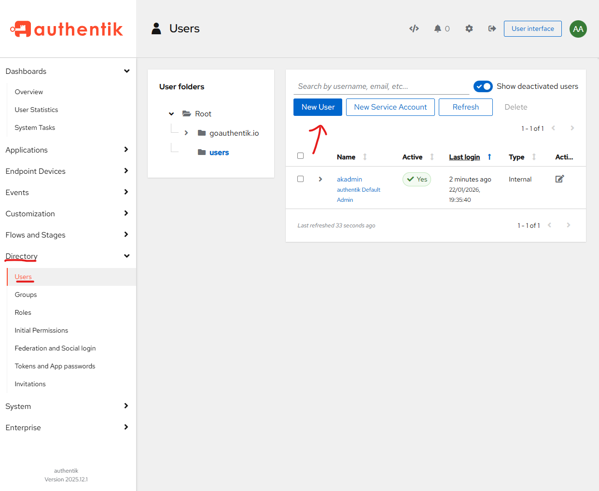

Once is done, edit and add the Admin Group on the user.

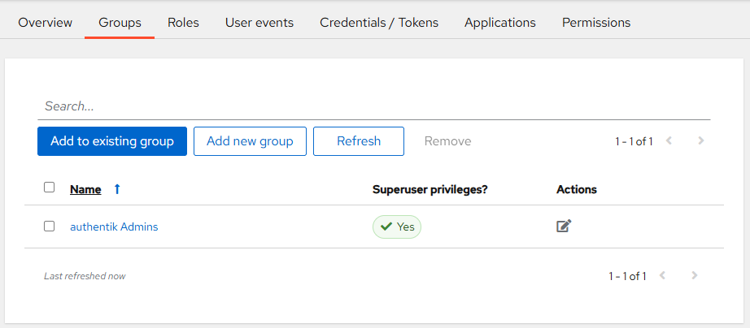

#### Securing Applications

##### Using Proxy Provider

For applications like AdGuardHome or just subdomains without any auth on them, you can secure them using this. The proxy (in our case Traefik) would be in charge of doing the redirections ensuring that you are logged.

To do it, `Applications` > `Providers` > `New Provider` > `Proxy Provider`

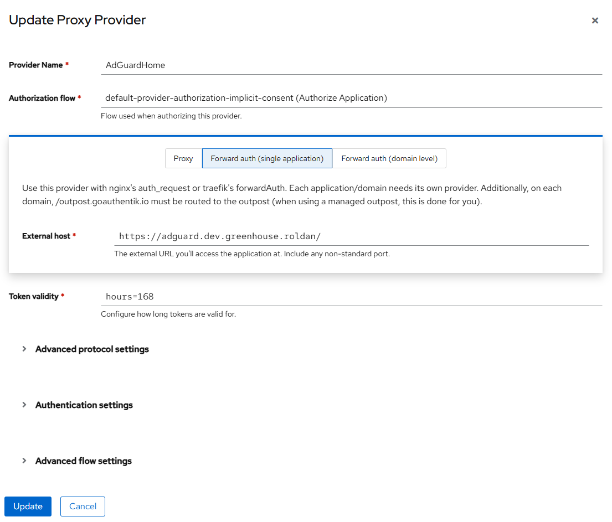

Now the Application to secure; `Applications` > `Applications` > `Create`

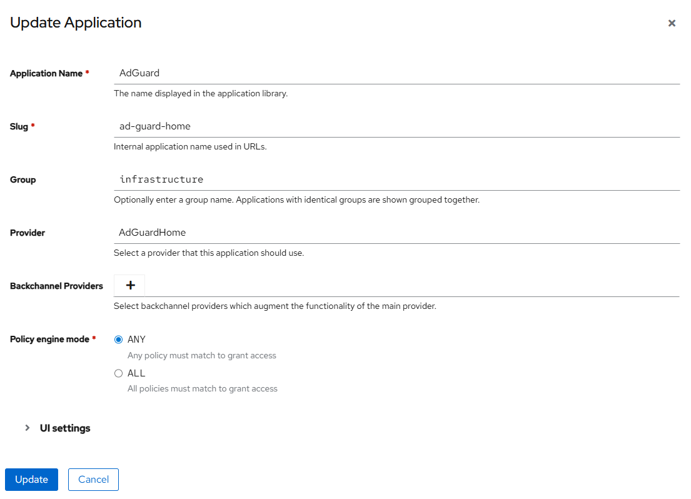

##### Using OAuth2/OpenID

Make sure before continue that the application that you are trying to secure with OAuth2/OpenID does support it. If not, I guess using the Proxy Provider should be enough.

###### Stirling PDF

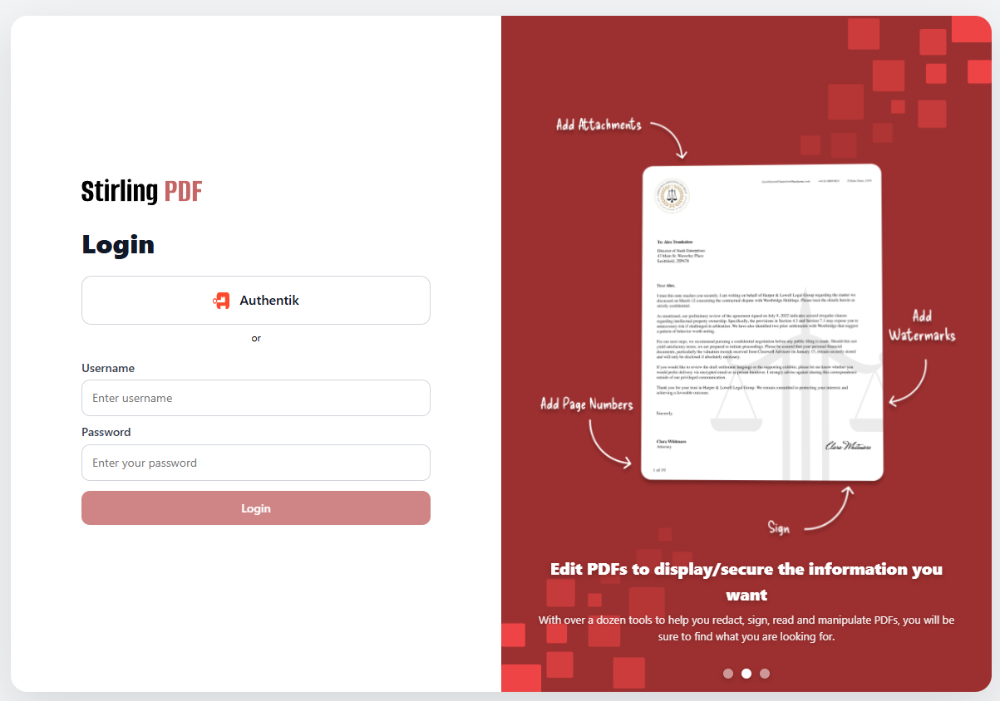

They required a licence (that for personal use does not make ANY sense) to user OAuth2 on them. The issue that I have, as the project is generating their own CA certificate, was refusing connections due to the lack of trust on the certificates. 
Just follow this [link](https://docs.stirlingpdf.com/Functionality/Security/Certificate-Signing/#signature-validation-fails) to fix it. I adding a new volume with the Step-CA certificates and add then with the command.

```yaml
...
volumes:
      - ${greenhouse_pdf_volume_tessdata:-${PWD}/pdf/${ENV}/tessdata}:/usr/share/tessdata
      - ${greenhouse_pdf_volume_configs:-${PWD}/pdf/${ENV}/configs}:/configs
      - ${greenhouse_pdf_volume_logs:-${PWD}/pdf/${ENV}/logs}:/logs
      - ${greenhouse_pdf_volume_pipeline:-${PWD}/pdf/${ENV}/pipeline}:/pipeline
      - ${greenhouse_ca_volume_certs:-${PWD}/step-ca/${ENV}/certs}:/usr/local/share/ca-certificates/ # <---- This line
...
```

```bash
$ docker exec stirling-pdf update-ca-certificates
```

After that, if you have licence, it should work. If not, will redirect you to url `https://your-domain/errorOAuth=oAuth2RequiresLicense`.

### Wireguard

For dev environment, the files are already committed on the repository, but at the time of doing it the deployment on your server, you will have to do it from the scratch.

The current configuration that you will have to handle are:

*  DNS configuration.
* Host (in our case provided by NoIP).
* User creation.

> Make sure of doing all changes before creating any user. Once the user is imported to the client, there are configurations that if vary, you will have to reimport them, like DNS changes.

A quick note over DNS configuration, is to add first the IP of Adguard, and later some extra DNS. [In our case we are using the DNS provided by the EU](https://www.joindns4.eu/for-public).

### Twingate

I agree that using an external provider to connect to your local network is not one of the best ideas but they provide security and the most important thing. My ISP was blocking my external connections and I wasn't able to make the VPN work. Basically, Twingate offer me an opportunity of connecting to all my setup without having to expose any port of the internet or maintain any domain as I was doing with No-IP.

#### Configuration

It's very simple once you start to play with it a little bit. 
In my case, only for dev, I created a Network called **gh-sobremesa** and attach to it 4 items as you can see on the screenshot of below:


* **Dev | AdGuardHome**: This resourse has the port 443 exposed plus the alias of adguard.dev.greenhouse.ogt. Basically is for be able to access to the dashboard. The IP belongs to the Traefik service, remember that is the proxy who is serving the dashboard.
* **Dev | AdGuardHome DNS**: As the port 53 is exposed on the service, you have to create a new Resource only for that.
* **Dev | Main Page**: It serves dev.greenhouse.ogt on 443.
* **Dev | Traefik**: It serve traefik.dev.greenhouse.ogt with his dashboard as well as the service WhoAmI. Both on the 443.

Inside the configuration you can select how you want to define the resource:


Based on value that you provided on the dropdown, later will appear or not once you are logged and connected to Twingate. Making easy to navigate between your services and hiding API or any other resources. Quite cool.


#### The Problem!

The DNS is not working as expected. Twingate is not using as DNS my internal container, is resolving using his internal DNS. I can use external or third party DNS, where I would be able to expose my DNS and use it, as a solution to this but my current ISP is not allowing me to do it...

On AdGuardHome, all request are going encrypted to Twingate, not allowing to filter the requests....

### AdGuardHome

The most important configuration to perform on Adguard at the moment are **the DNS Rewrite** and **the DNS blocklist**.

#### DNS blocklist

This is easy, read Reddit or just a quick search on the internet and select those that seems to be the ones you like it. As simple as that.

#### DNS Rewrite


This is the sample that I use on my dev environment. I will explain below some issues and problem that I face when I was configuring this.

#### Why multiple lines by Domain?

The reason of having multiple lines by domain is to let AdGuardHome to provide the most efficient IP to the client. In case you are connected with VPN or Twingate or just in local. The DNS will rewrite the best option.

#### Why are you not using *.dev.greenhouse.ogt?

Traefik is being configured on the project to serve the content by domain, but using the *.dev.greenhouse.ogt will redirect as well the traffic of the CA to Traefik and it should not do that.

### [Jellyfin](https://jellyfin.org/)

I really like the app for serve local movies and show that I have in my computer. In any case was really heavy for the Raspberry Pi. I was trying to watch a movie and was enough laggy to stop it.

### Monitoring

At the moment I did only deploy [Rpi Monitor][rpi_mon] to watch the resources that [Jellyfin][jellyfin] was using plus knowing how was the status of the raspberry. I will improve this part with Grafana as well as centralizing the logs. WIP.

#### RPi Monitor


### Tooling

#### Stirling PDF

Tool for editing PDF's and avoid to expose, upload or whatever any PDF to any weird app or webpage. 

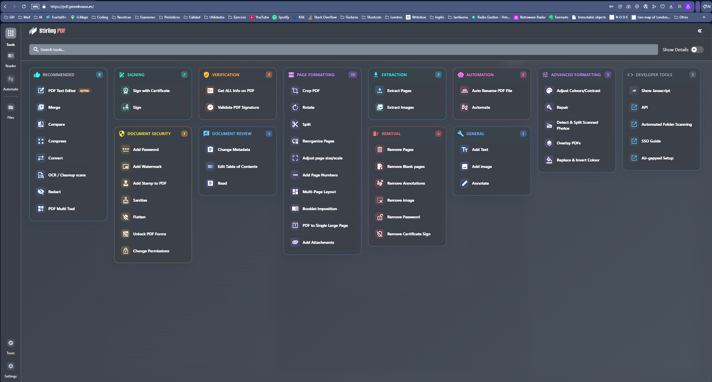

#### IT Tools

Group of IT Tools that are nice to have and same as Stirling PDF, with this you avoid any risk of uploading data to weird pages.

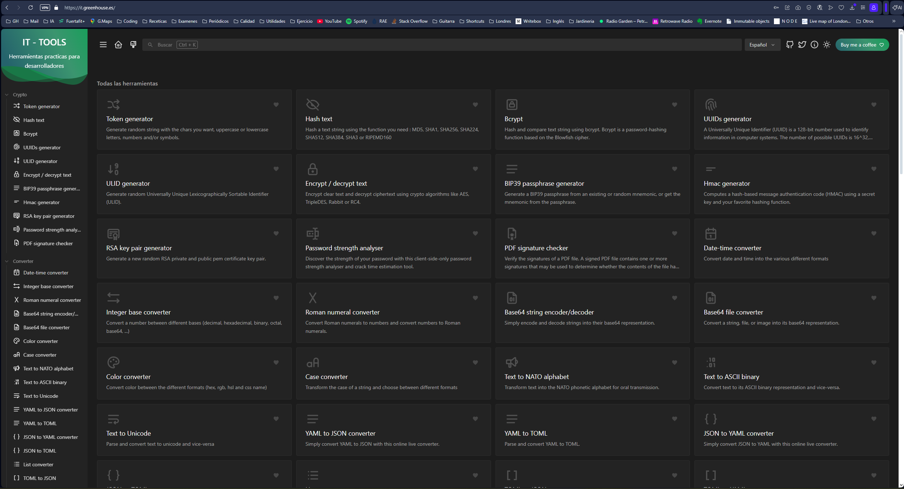

### Nextcloud

Raspberry Pi seems to be handling  Nextcloud with the databases really well. I just make the install and perform the next changes on the configuration. 

```php
<?php
$CONFIG = array (
  ...
  'default_language' => 'es',
  'default_locale' => 'es_ES',
  'default_phone_region' => 'ES',
  'default_timezone' => 'Europe/Madrid',
  ...
  'trusted_domains' => 
  array (
    0 => 'localhost',
    1 => '*.dev.greenhouse.ogt',
    2 => '127.0.0.1',
    3 => '42.42.42.100',
  ),
  'trusted_proxies' => 
  array (
    0 => '127.0.0.1',
    1 => '42.42.42.50',
  ),
  'forwarded_for_headers' => 
  array (
    0 => 'HTTP_X_FORWARDED',
    1 => 'HTTP_FORWARDED_FOR',
  ),
  ...
  'mail_smtpmode' => 'smtp',
  'mail_sendmailmode' => 'smtp',
  'mail_smtpport' => '587',
  'mail_smtphost' => 'smtp.gmail.com',
  'mail_domain' => 'gmail.com',
  'mail_from_address' => 'dev-account',
  'mail_smtpauth' => true,
  'mail_smtpname' => 'dev-account@gmail.com',
  'mail_smtppassword' => 'a_p@ssw0rd',
  'skeletondirectory' => '',
  'templatedirectory' => '',
  'logo_url' => 'https://raw.githubusercontent.com/RoldanGreenhouse/ivy-automation/refs/heads/56-add-cloud-services-and-multimedia-player-on-rpi/drawio/logo.png',
  'mail_domain' => 'dev.greenhouse.com',
  'mail_from_address' => 'admin',
  ...
);

```

After this, I just modified the theme and everything was working smoothly.

> IMPORTANT for **GMAIL**! To make the email work, go to the Profile of the admin user and assign an email, the same given on the IMAP configuration. Is what I did to make it work.
>
> https://www.reddit.com/r/NextCloud/comments/1jydvvb/using_gmail_as_email_server/

### Traefik

We will be using this service as Proxy Reverse. Each Service will be configured to use the correct subdomain plus to challenge against the CA using Traefik.

### TeamSpeak

On the first try I went for the [Official Image provided by Teamspeak][teamspeak], but they do not support the RPI architecture. 
I did a little research and looking for number and [ertagh version][ts_ertagh] is the one that I like the most. The bad side of this is he does not use any volume, so if I run **down** or similar, the configuration will go bananas :D

In any case. The port forwarding is only applied for port **9987** (voice channel), as for security reason, I will remain close access only on the local network for ports **10011** (Server Query) & **30033** (File Manager).

### Docker Hub Links

+ [nginx]: https://hub.docker.com/_/nginx	"Official Nginx"

+ [wireguard]: https://hub.docker.com/r/linuxserver/wireguard	"Official Wireguard"

+ [ez_wg]: https://hub.docker.com/r/weejewel/wg-easy	"Easy Wireguard"

+ [tw]: https://www.twingate.com/ "Twingate Main Page"

+ [tw_con]: https://hub.docker.com/r/twingate/connector "Official Twingate Connector Image"

+ [adguard]: https://hub.docker.com/r/adguard/adguardhome "Official Adguard image"

+ [teamspeak]: https://hub.docker.com/_/teamspeak "Official TeamSpeak image"

+ [ts_ertagh]: https://hub.docker.com/r/ertagh/teamspeak3-server "TeamSpeak by ertagh"

+ [noip]: https://hub.docker.com/r/noipcom/noip-duc "Official NoIP for Ip Synchronization"

+ [traefik]: https://hub.docker.com/_/traefik "Official Traefik image"

+ [ca]: https://hub.docker.com/r/smallstep/step-ca "Official Step-CA image"

+ [jellyfin]: https://hub.docker.com/r/jellyfin/jellyfin "Official Jelllyfin image"

+ [nextcloud]: https://hub.docker.com/_/nextcloud "Official Nexcloud Image"

+ [redis]: https://hub.docker.com/_/redis "Official Redis Image"

+ [postgres]: https://hub.docker.com/_/postgres "Official Postgres Image"

+ [rpi_mon]: https://hub.docker.com/r/michaelmiklis/rpi-monitor "A simple monitor for RPi"

## Nice Readings

* [Software Architecture Patterns](https://dev.to/somadevtoo/9-software-architecture-patterns-for-distributed-systems-2o86)