# Greenhouse Ivy - Automations & Utils
## Ansible

### Configuration

To configure the project, we have created the folder `/greenhouse` that will contain this repository with all devops configs.

See below the three of folders:

```
/greenhouse/
└── ivy-automation
    ├── ansible
    │   ├── ansible.cfg
    │   ├── ansible_vault_password
    │   ├── inventory
    │   │   ├── computers
    │   │   └── host_vars
    │   │       ├── debian.yml
    │   │       ├── rpi.yml
    │   │       ├── vault.yml (only on the machine. Ignored on repo.)
    │   │       └── w3070.yml
    │   ├── playbooks
    │   │   ├── ping.yml
    │   │   └── variable_checker.yml
    │   └── ssh
    │       ├── id_ansible
    │       └── id_ansible.pub
    ├── LICENSE
    ├── profiles
    │   └── ...
    └── README.md

```

#### Inventory

File that will contain the list of IP, hostnames or DNS names that Ansible will manage. On [ansible.cfg](./ansible/ansible.cfg) file, we have added the variable `inventory` that contains the path for the main inventory that we will use.

```yml
all:
    children:
        windows:
            hosts:
                w3070:
        linux:
            hosts:
                rpi:
                debian:
        vbox:
            hosts:
                debian:
        greenhouse:
            hosts:
                w3070:
                rpi:
                debian:
```

#### Connectivity Check

Let first add the next command to ensure that ansible is able to reach all given machines in `/ansible/config/inventory` file.

```bash
$ ansible all --key-file /path/to/ssh/key -i /path/to/inventory/file -m ping --limit {host-name}
# ex
$ ansible all -i inventory.yaml -m win_ping --limit w3070
$ ansible all -i inventory.yaml -m ping --limit rpi
```

#### WinRm - Setting Up a Windows Host

Using as reference [Official Ansible Docs for Windows Setup][Official Ansible Docs - Windows Setup]

##### Upgrade of Powershell

```powershell
# Check versions available
> winget search Microsoft.PowerShell
# Install
> winget install --id Microsoft.Powershell --source winget
> winget install --id Microsoft.Powershell.Preview --source winget
```

### SSH Key Generation

To check the current Keys check folder `\home\{user}\.ssh`. Inside should be located the file `known_hosts` plus the keys generated.

```bash
# To generate a key, execute the next command:
$ ssh-keygen -t ed25519 -C Ansible
# To copy the ssh key to a Server
$ ssh-copy-id -i {oath of public ssh key. ie: /home/gh/.ssh/id.pub} {IP of the Server}
```

### Vaults

To make the setup, we created the file `inventory/host_vars/vault.yml` and added all credentials to make reference to them later on playbooks.

Once created, just do `ansible-vault encrypt`.

```bash
$ ansible-vault encrypt --vault-password-file ansible_vault_password inventory/host_vars/vault.yml
$ ansible-vault view --vault-password-file ansible_vault_password inventory/host_vars/vault.yml  
$ ansible-vault edit --vault-password-file ansible_vault_password inventory/host_vars/vault.yml
```

On [ansible.cfg](./ansible/ansible.cfg) file, we have added the variable `vault_password_file` that contains the password used to encrypt in vault. So it won't require to use the flag `--vault-password-file ansible_vault_password` anymore.

### References

[Official Docs - Debian installation]: https://docs.ansible.com/ansible/latest/installation_guide/installation_distros.html#installing-ansible-on-debian 	"Debian Installation"
[Youtube - Learn Linux TV - Getting Started with Ansible]: https://www.youtube.com/playlist?list=PLT98CRl2KxKEUHie1m24-wkyHpEsa4Y70 "Learn Linux TV - Getting Started with Ansible"
[Reference - Jeff Geerling]: https://www.jeffgeerling.com/blog	"Jeff Geerling"
[Reference - Percy Grunwald]: https://www.percygrunwald.com/ "Percy Grunwald"
[Official Ansible Docs - Windows Setup]: https://docs.ansible.com/ansible/latest//os_guide/windows_setup.html#windows-setup "Windows Setup"

## Profiles
The `.bashrc` file includes few tiny functions that would help and make environments more comfortable.

### Required Environment Variables

| Variable  Name              | Description                                                  | Example                           |
| --------------------------- | ------------------------------------------------------------ | --------------------------------- |
| `BASE_GREENHOUSE_WORKSPACE` | Main folder where the repositories of Greenhouse are placed. | /c/Users/mike/Documents/Workspace |

## Quick summary of System CTL commands:

Explanation of Commands:

- `systemctl start <service>`: Starts the service immediately (in this case, SSH).
- `systemctl enable <service>`: Enables the service to start automatically at system boot.
- `systemctl status <service>`: Shows the current status of the service (running, stopped, etc.).
- `systemctl is-enabled <service>`: Checks if the service is enabled to start on boot.
- `systemctl stop <service>`: Stops the service immediately.
- `systemctl disable <service>`: Disables the service from starting at boot.

## Docker


### Docker Compose

The  [main file](docker/docker-compose.yml)  has been split to avoid to have one big file wiht eveything. This will make the maintenance and review changes more confortable.

| Filename                                                     | Description & Content                                        |
| :----------------------------------------------------------- | ------------------------------------------------------------ |
| [docker-compose.yml](docker/docker-compose.yml)              | Network, Volumes and Include the rest of the docker-compose files. |
| [docker-compose.critical.yml](docker/docker-compose.critical.yml) | [CA Server][ca] & [AdGuardHome][adguard]                     |
| [docker-compose.proxy.yml](docker/docker-compose.proxy.yml)  | [Traefik][traefik]                                           |
| [docker-compose.frontend.yml](docker/docker-compose.frontend.yml) | Greenhouse Main Page.                                        |
| [docker-compose.apps.yml](docker/docker-compose.apps.yml)    | [NoIP][noip], [TeamSpeak][teamspeak] & Traefik Dummy Whoami  |
| [docker-compose.vpn.yml](docker/docker-compose.vpn.yml)      | [Wireguard EZ][ez_wg]                                        |

### Environment File

To wake up this project you will require to setup several environment files:

- Main environment file
- Each service that require his environment file (example [NoIP-duc][noip] for credentials)

You can follow the templates defined on [.template.env](docker\env\.template.env). The service that requires the file, should have a .template file as well.

```yaml
ENV="dev"
DOMAIN="${ENV}.greenhouse.ogt"

# Scales
# Info pill. This are the number of instances that will be
# created once is running the Docker Compose. Most of the 
# services will only accept one.
# So summarizing:
# - Do 0 or 1 if you want the service to be deployed.
# - If you want multiple instances of one service.... be sure that is going to work
greenhouse_scale_noip_sync=0
greenhouse_scale_traefik=1
greenhouse_scale_traefik_whoami=1
greenhouse_scale_ca=1
greenhouse_scale_adguard=1
greenhouse_scale_wireguard=1
greenhouse_scale_nginx=1
greenhouse_scale_teamspeak=0

# Networking
greenhouse_network_name="${ENV}-greenhouse-infra"
greenhouse_network_subnet="192.168.42.0/24"
greenhouse_network_gateway="192.168.42.42"

# Main Page
greenhouse_nginx_static_pages_ip="192.168.42.10"
greenhouse_nginx_static_pages_host="${DOMAIN}"
greenhouse_nginx_static_pages_volume_conf="${PWD}/nginx/${ENV}/conf"
greenhouse_nginx_static_pages_volume_html="${PWD}/nginx/${ENV}/html"

# Step CA - Certificate Authority Sever
greenhouse_ca_ip="192.168.42.70"
greenhouse_ca_port=9000
greenhouse_ca_host="ca.${DOMAIN}"

greenhouse_ca_volume_certs="${PWD}/step-ca/${ENV}/certs"
greenhouse_ca_volume_secrets="${PWD}/step-ca/${ENV}/secrets"
greenhouse_ca_volume_config="${PWD}/step-ca/${ENV}/config"

greenhouse_ca_config_name="Greenhouse ${ENV} CA Server"
greenhouse_ca_config_dns_names="localhost,*.${DOMAIN},${DOMAIN}"
greenhouse_ca_config_provisioner_name=admin
greenhouse_ca_config_ssh=greenhouse
greenhouse_ca_config_password=ogt-0123456789-@@

# AdGuardHome
greenhouse_adguard_ip="192.168.42.30"
greenhouse_adguard_host="adguard.${DOMAIN}"
greenhouse_adguard_volume_work="${PWD}/adguard/${ENV}/work"
greenhouse_adguard_volume_conf="${PWD}/adguard/${ENV}/conf"

# TeamSpeak
greenhouse_teamspeak_ip="192.168.42.40"
greenhouse_teamspeak_port_voice=9987
greenhouse_teamspeak_port_query=10011
greenhouse_teamspeak_port_file=30033
greenhouse_teamspeak_image="ertagh/teamspeak3-server"

# Traefik
greenhouse_traefik_log_level=INFO # Default INFO. Available: DEBUG INFO WARN ERROR FATAL PANIC
greenhouse_traefik_api_dashboard=false
greenhouse_traefik_api_insecure=false
greenhouse_traefik_ip="192.168.42.50"
greenhouse_traefik_host="traefik.${DOMAIN}"

greenhouse_traefik_acme_email=your_email@provider.com
greenhouse_traefik_acme_certificates_duration=168 # Weekly Refresh

greenhouse_traefik_whoami_ip="192.168.42.60"
greenhouse_traefik_whoami_host="traefik.${DOMAIN}"

# Wireguard VPN
greenhouse_wireguard_ip="192.168.42.20"
greenhouse_wireguard_port_ui=51821
greenhouse_wireguard_port_vpn=51820
greenhouse_wireguard_host="vpn.${DOMAIN}"
greenhouse_wireguard_volume="${PWD}/wireguard/${ENV}"
greenhouse_wireguard_ui_insecure=false
```

### Ports

> First of all, log in on your router, and apply the port forwarding for the machine that you will use as a host pf this project.
>
> Each router has their own way of configuring this, so time to use Google.

|           Application           |        Default Ports         | Description                                                  |  Port Forwarding   |
| :-----------------------------: | :--------------------------: | ------------------------------------------------------------ | :----------------: |
|       [Wireguard][ez_wg]        |            51820             | VPN connectivity                                             | :white_check_mark: |
|       [Wireguard][ez_wg]        |            51821             | UI                                                           |         ❌          |
|       [Adguard][adguard]        |             3000             | Initial config                                               |         ❌          |
|       [Adguard][adguard]        |              53              | DNS                                                          |         ❌          |
|       [Adguard][adguard]        |              80              | UI                                                           |         ❌          |
|       [Main Nginx][nginx]       |              80              | Dummy UI                                                     |         ❌          |
|        [NoIP-duc][noip]         |              -               | No-IP sync                                                   |         ❌          |
| [Teamspeak (ertagh)][ts_ertagh] |             9987             | Voice                                                        | :white_check_mark: |
| [Teamspeak (ertagh)][ts_ertagh] |            10011             | Server Query                                                 | :white_check_mark: |
| [Teamspeak (ertagh)][ts_ertagh] |            30033             | File transfer                                                | :white_check_mark: |
|       [Traefik][traefik]        |             8080             | Dashboard                                                    |         ❌          |
|       [Traefik][traefik]        | Any Port required to forward | You should move the port from the service to Traefik to handle the request instead of expose it directly |     :question:     |

### Firewall

The only port at the moment that is required to be included on the firewall is the connectivity for port for [Wireguard][wireguard], port **51820**.

#### Windows

Search and open **Windows Defender Firewall**. Go to **Advanced settings**

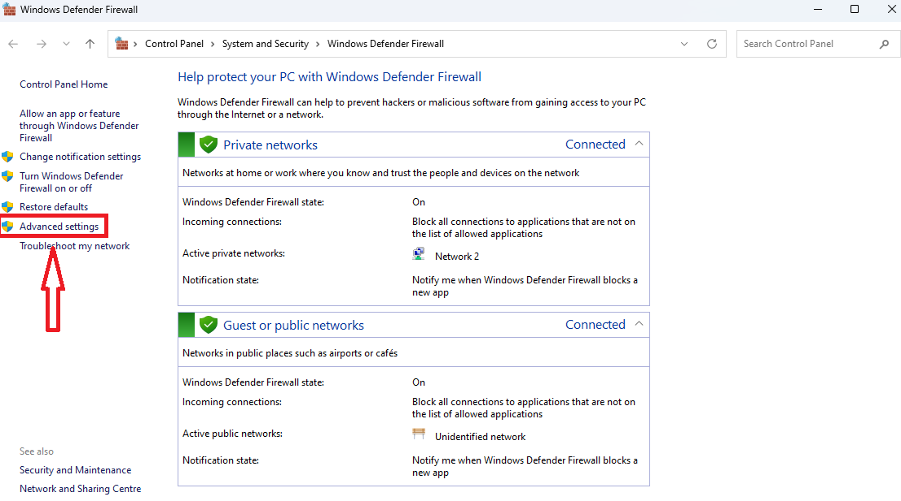

Go to **Inbound Rules** and **New Rule...** as we are allowing external connections.

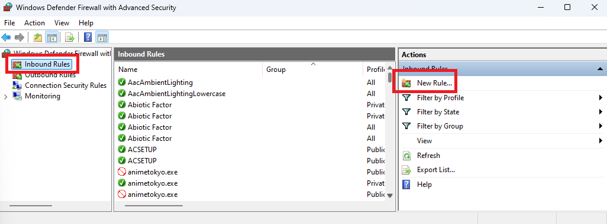

Click on **Port** and add the list of ports provided above + click on **TCP**.

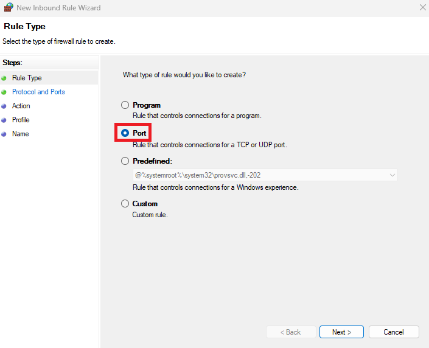

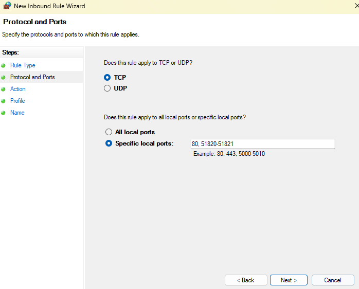

Let's go at the moment with Allow the connection option.

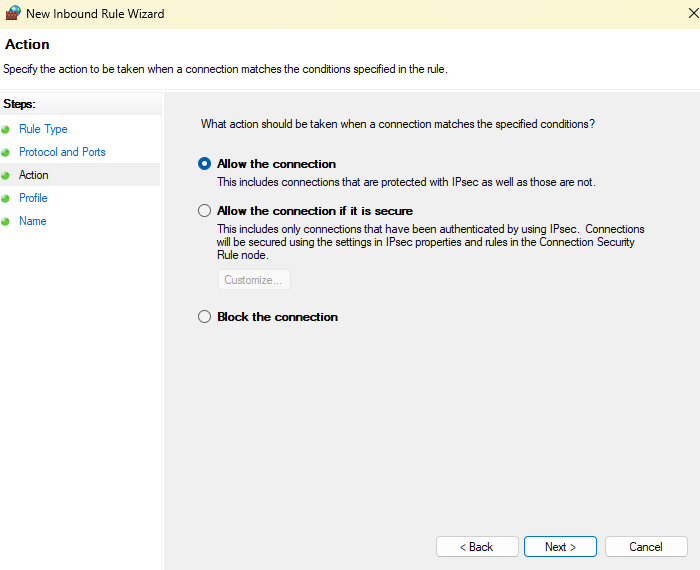

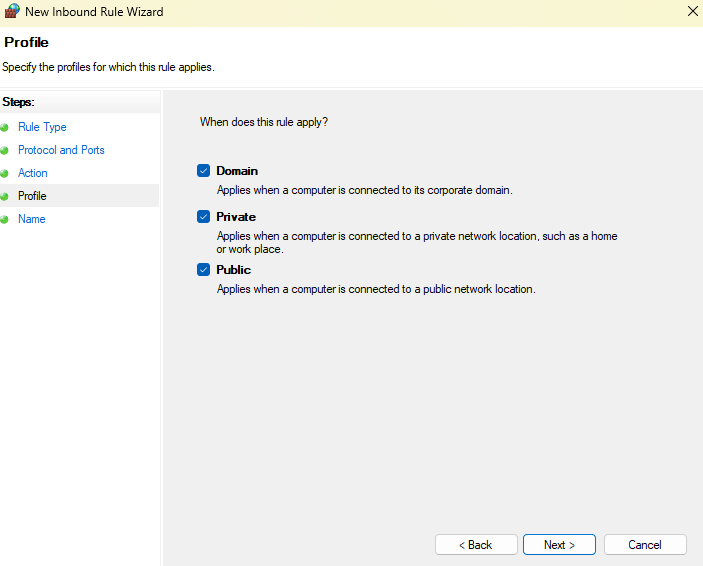

Once completed, you will see the new rule on the Inbound Rules window. In this sample, **Greenhouse Ports**.

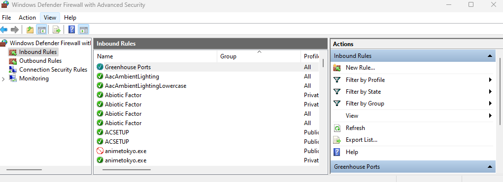

#### Mac

Open the terminal and modify the next file

``````bash
> sudo nano /etc/pf.conf
``````

**For each** port that you want to open, add the next line:

``````bash
pass in proto tcp from any to any port [PORT]
``````

The next lines would be use to activate/deactivate the rule:

``````bash
> sudo pfctl -f /etc/pf.conf
# Activate
> sudo pfctl -e
# Deactivate
> sudo pfctl -d
``````

To test if it is working or not:

``````bash
> sudo lsof -i :[PORT]

# The expected response should something similar to this:

> sudo lsof -i :51820
COMMAND    PID      USER   FD   TYPE             DEVICE SIZE/OFF NODE NAME
com.docke 3836   usename  200u  IPv6 0x0000000000000001      0t0  UDP *:51820
> sudo lsof -i :51821
COMMAND    PID      USER   FD   TYPE             DEVICE SIZE/OFF NODE NAME
com.docke 3836   usename  199u  IPv6 0x0000000000000001      0t0  TCP *:51821 (LISTEN)
``````

### How to Forward traffic from [NoIp](https://www.noip.com/) to the computer

The way how the Internet provider maintain our IP can be different. They can update our IP when we restart the router or in any moment. 

There are lot of webages that can provide this info ([ipinfo.io](https://ipinfo.io/what-is-my-ip), [ipaddress.my](https://www.ipaddress.my/), [showmyip.com](https://www.showmyip.com/), [whatismyip.com](https://www.whatismyip.com/)...).

> Why NoIp? They offer by free one hostname which we will use to forward our traffic for, here it comes, **FREE**.

The screenshot of below shows how the NoIp hostname page looks like. Here you will see your hostname plus the IP where is aiming at the moment. When you are developing, you can, a, ping directly your public IP or b, use this domain.

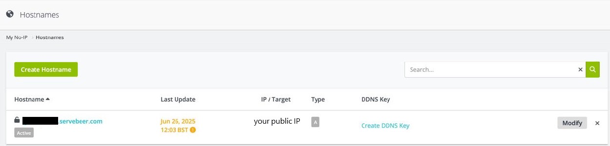

### Certificate Authority Server

For this, we will be using [smallstep/step-ca][ca] image. 

[Follow their documentation page to make a initial setup of the server before continue](https://smallstep.com/docs/tutorials/docker-tls-certificate-authority/).

Greenhouse is aiming to have your own local domain only accessible once you are connected with the VPN. Because of that, you will not need buy any domain or trust any external CA for much open-source they are.

> Be aware if you are using a Raspberry Pi as I am, [to check this link](https://smallstep.com/docs/tutorials/docker-tls-certificate-authority/#raspberry-pi-badger-database-errors). In my case it happen 2 issues:
>
> First one was fixed applying the changes on the link regarding the DB:
>
> ```json
>  "db": {
>        "type": "badger",
>        "dataSource": "/home/step/db",
>        "badgerFileLoadingMode": "FileIO"
>  },
> ```
>
> And later, I had to update the permissions of my volume folders. But this is my issue as my users are not very well configured:
>
> >  docker run --rm -v prod-ca-db:/data alpine chown -R 1000:1000 /data
>
> For windows, run this command on Powershell to avoid 
>
> > docker run --rm -v de-ca-db:/home/step/db alpine chown -R 1000:1000 /home/step/db

If everything works as expected, execute the commands of below to include the new provisioner.

```bash
# Log to the container the 
> docker exec -it ca sh

# Add the new ACME provisioner. After this, ensure to restart to asure the config has been applied.
> step ca provisioner add greenhouse-acme --type ACME
```

With this, should be enough to make it work!

> DONT FORGET TO INCLUDE THE NEW CERTIFICATES IN YOUR DEVICES !

Additionally, I added few improvements on the ca.json. Not sure if neccesary but I will list them below:

    ...
    	"dnsNames": [
    		"localhost",
    		"ca.dev.greenhouse.ogt",
    		"traefik.dev.greenhouse.ogt",
    		"vpn.dev.greenhouse.ogt",
    		"adguard.dev.greenhouse.ogt",
    		"dev.greenhouse.ogt"
    	],
    ...
    	"policy": {
    		"x509": {
    			"allow": {
    				"dns": ["*.dev.greenhouse.ogt"]
    			},
    			"allowWildcardNames": false
    		},
    		"host": {
              "allow": {
    				"dns": ["*.dev.greenhouse.ogt"]
              }
            }
    	},
    ...
    			{
    				"type": "ACME",
    				"name": "greenhouse-acme",
    				"claims": {
    					...
    				},
    				"challenges": [
    					"http-01"
    				],
    				"attestationFormats": [
    					"apple",
    					"step",
    					"tpm"
    				],
    				"options": {
    					"x509": {},
    					"ssh": {}
    				}
    			}


### Wireguard

For dev environment, the files are already committed on the repository, but at the time of doing it the deployment on your server, you will have to do it from the scratch.

The current configuration that you will have to handle are:

*  DNS configuration.
* Host (in our case provided by NoIP).
* User creation.

> Make sure of doing all changes before creating any user. Once the user is imported to the client, there are configurations that if vary, you will have to reimport them, like DNS changes.

A quick note over DNS configuration, is to add first the IP of Adguard, and later some extra DNS. [In our case we are using the DNS provided by the EU](https://www.joindns4.eu/for-public).

### Twingate

I agree that using an external provider to connect to your local network is not one of the best ideas but they provide security and the most important thing. My ISP was blocking my external connections and I wasn't able to make the VPN work. Basically, Twingate offer me an opportunity of connecting to all my setup without having to expose any port of the internet or maintain any domain as I was doing with No-IP.

#### Configuration

It's very simple once you start to play with it a little bit. 
In my case, only for dev, I created a Network called **gh-sobremesa** and attach to it 4 items as you can see on the screenshot of below:

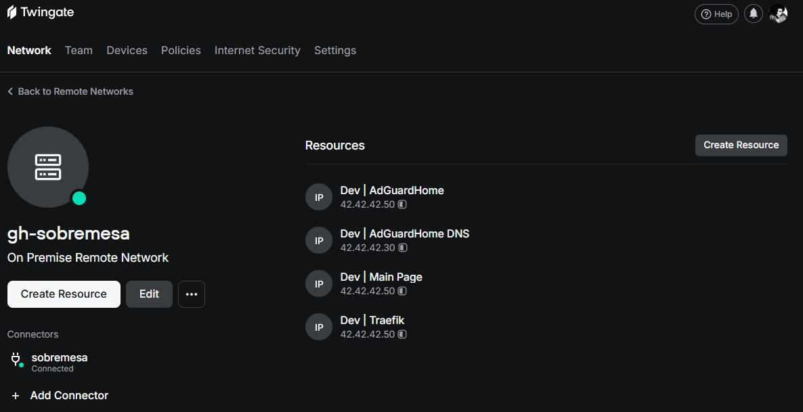

* **Dev | AdGuardHome**: This resourse has the port 443 exposed plus the alias of adguard.dev.greenhouse.ogt. Basically is for be able to access to the dashboard. The IP belongs to the Traefik service, remember that is the proxy who is serving the dashboard.
* **Dev | AdGuardHome DNS**: As the port 53 is exposed on the service, you have to create a new Resource only for that.
* **Dev | Main Page**: It serves dev.greenhouse.ogt on 443.
* **Dev | Traefik**: It serve traefik.dev.greenhouse.ogt with his dashboard as well as the service WhoAmI. Both on the 443.

Inside the configuration you can select how you want to define the resource:
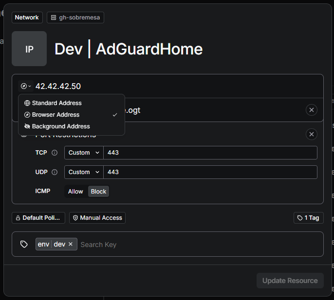

Based on value that you provided on the dropdown, later will appear or not once you are logged and connected to Twingate. Making easy to navigate between your services and hiding API or any other resources. Quite cool.

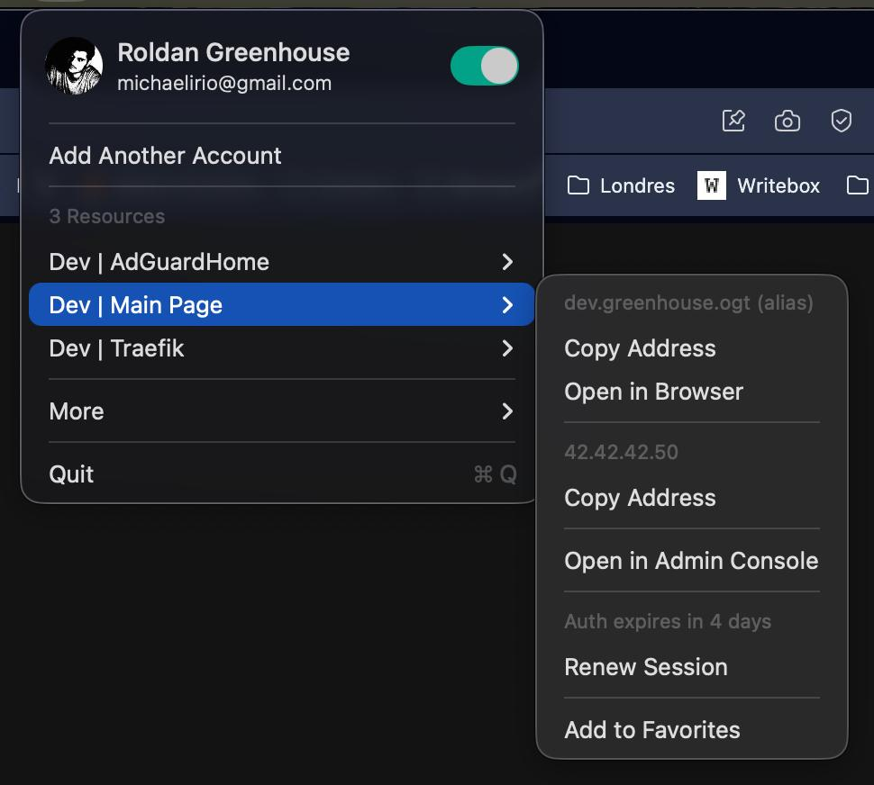

### AdGuardHome

The most important configuration to perform on Adguard at the moment are **the DNS Rewrite** and **the DNS blocklist**.

#### DNS blocklist

This is easy, read Reddit or just a quick search on the internet and select those that seems to be the ones you like it. As simple as that.

#### DNS Rewrite

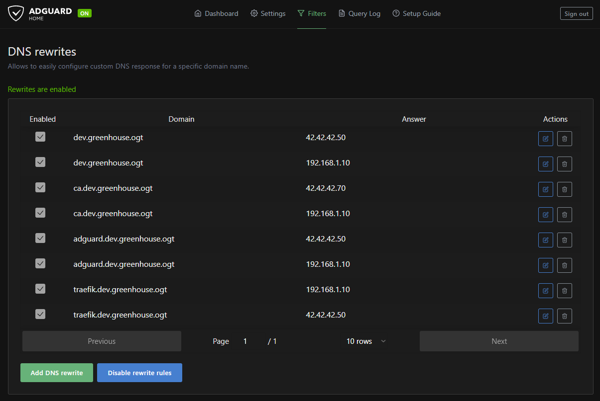

This is the sample that I use on my dev environment. I will explain below some issues and problem that I face when I was configuring this.

#### Why multiple lines by Domain?

The reason of having multiple lines by domain is to let AdGuardHome to provide the most efficient IP to the client. In case you are connected with VPN or Twingate or just in local. The DNS will rewrite the best option.

#### Why are you not using *.dev.greenhouse.ogt?

Traefik is being configured on the project to serve the content by domain, but using the *.dev.greenhouse.ogt will redirect as well the traffic of the CA to Traefik and it should not do that.

### Traefik

We will be using this service as Proxy Reverse. Each Service will be configured to use the correct subdomain plus to challenge against the CA using Traefik.

### TeamSpeak

On the first try I went for the [Official Image provided by Teamspeak][teamspeak], but they do not support the RPI architecture. 
I did a little research and looking for number and [ertagh version][ts_ertagh] is the one that I like the most. The bad side of this is he does not use any volume, so if I run **down** or similar, the configuration will go bananas :D

In any case. The port forwarding is only applied for port **9987** (voice channel), as for security reason, I will remain close access only on the local network for ports **10011** (Server Query) & **30033** (File Manager).

### Docker Hub Links

+ [nginx]: https://hub.docker.com/_/nginx	"Official Nginx"

+ [wireguard]: https://hub.docker.com/r/linuxserver/wireguard	"Official Wireguard"

+ [ez_wg]: https://hub.docker.com/r/weejewel/wg-easy	"Easy Wireguard"

+ [tw]: https://www.twingate.com/ "Twingate Main Page"

+ [adguard]: https://hub.docker.com/r/adguard/adguardhome "Official Adguard"

+ [teamspeak]: https://hub.docker.com/_/teamspeak "Official TeamSpeak"

+ [ts_ertagh]: https://hub.docker.com/r/ertagh/teamspeak3-server "TeamSpeak by ertagh"

+ [noip]: https://hub.docker.com/r/noipcom/noip-duc "Official NoIP for Ip Synchronization"

+ [traefik]: https://hub.docker.com/_/traefik "Official Traefik"

+ [ca]: https://hub.docker.com/r/smallstep/step-ca "Official Step-CA image"

## Nice Readings

* [Software Architecture Patterns](https://dev.to/somadevtoo/9-software-architecture-patterns-for-distributed-systems-2o86)